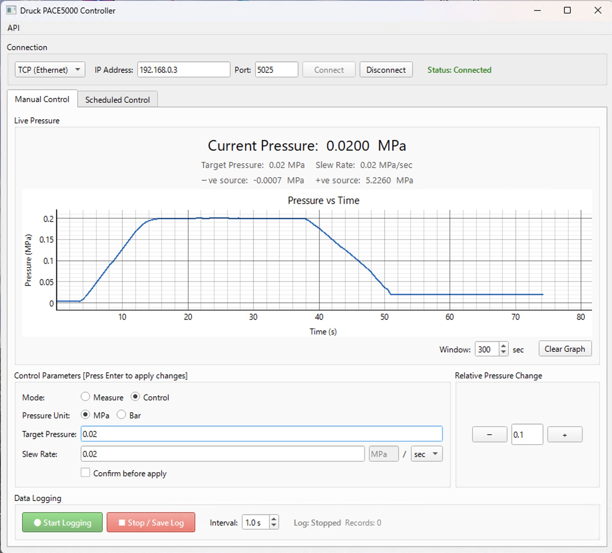
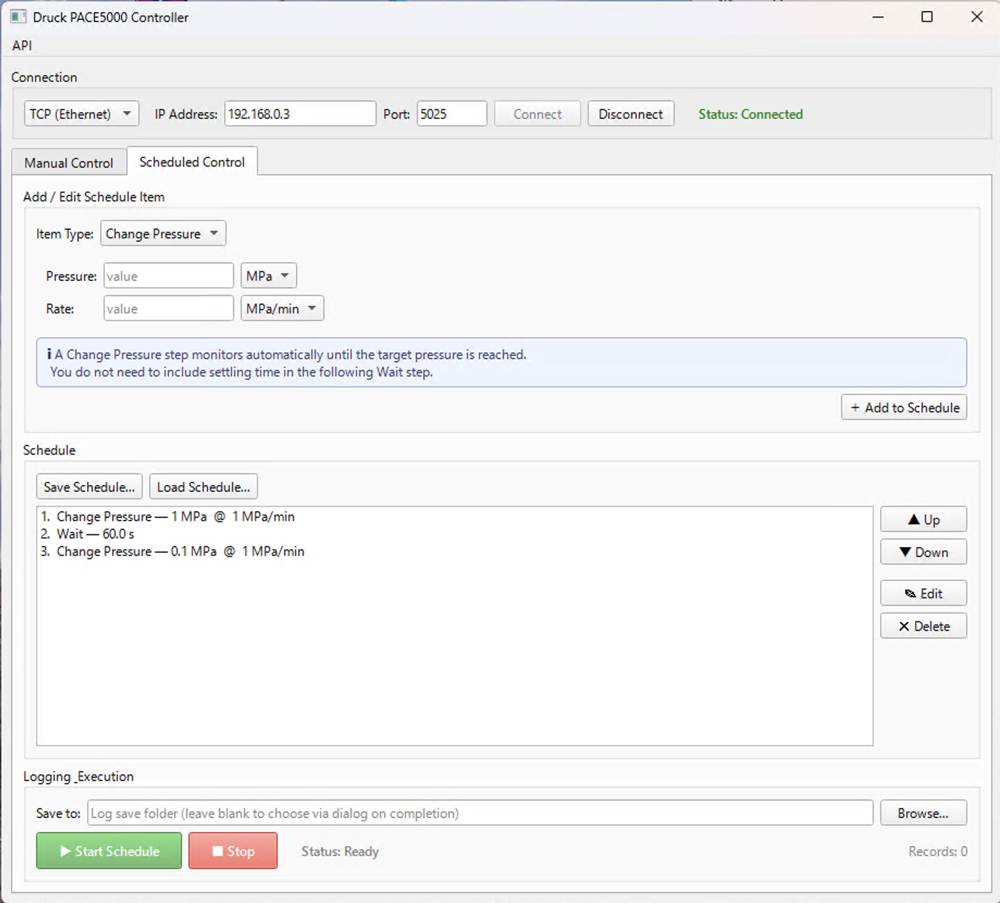

# PaceMaker

A PyQt6 desktop GUI for controlling and logging a **Druck PACE5000** pressure controller.

## Features

- Connect via **TCP/IP** (SCPI over port 5025) or **Serial (RS-232)**
- Set target pressure and slew rate; switch between Control / Measure modes
- Manual "Apply" (target field, +/- step buttons) goes through the same slew-rate-verified-before-setpoint path as Scheduled Control / exp_scheduler / the HTTP API (`Pace5000Backend.set_pressure_with_ramp()`) — a rate typed into the rate field is always sent and read-back-verified together with the target, never assumed to already be correctly set on the device
- Overshoot suppression (`:SOUR:PRES:SLEW:OVER 0`) is sent on every connect and is not user-configurable — this app has no scenario where overshoot past the setpoint is acceptable
- "Pressure reached" requires the reading to stay within tolerance continuously for `Pace5000Backend.DEFAULT_STABILITY_DWELL_S` (2 s) — a single in-tolerance sample is not enough. Enforced device-side via `:SOUR:PRES:INL` / `:SOUR:PRES:INL:TIME`, not user-configurable
- **Effort monitoring**: the controller effort (`:SOUR:PRES:EFF?`, -100 to +100 %) is read every poll and shown live next to the pressure reading. If it stays at/above 90% (either direction) for 30 s continuously, a warning appears explaining the likely cause (supply valve maxed → source pressure/slew rate; vacuum valve maxed → leak/blocked line) — useful for spotting a system that can't actually keep up with the requested ramp
- **Max Safe Pressure**: an optional, editable ceiling on the manual target field (and +/- step, and Scheduled Control items), pre-filled from the instrument's control-sensor full-scale (`:INST:SENS1:FULL?`) on connect but meant to be tightened per-experiment (e.g. to the gasket/diamond's actual safe limit) — not persisted across sessions, since the right value depends on what's currently mounted
- Live pressure chart with configurable time window
- CSV data logging
- **Scheduled control**: build a sequence of pressure steps and waits, save/load as JSON, and run with live plot and automatic logging
- **HTTP API** (standalone mode only): control and monitor the device from another process on the same machine, or another machine on the LAN — see [API](#api) below

### Main window


### Scheduled control window


## Requirements

- Python 3.11+
- PyQt6
- pyqtgraph
- pyserial

Install dependencies:

```
pip install PyQt6 pyqtgraph pyserial
```

## Usage

`app.py` is the only supported standalone entry point:

```
python app.py
```

This works whether this repository (PaceMaker) is cloned on its own, or checked out as the `apps/PACE5000/` submodule inside a larger project (e.g. `bl18c_controller`, run as `python apps/PACE5000/app.py` from that project's root) — `app.py` registers this directory as its own private package at runtime rather than assuming any particular parent directory structure, so `pace5000_app.py`, `pace5000_ui_main.py`, `pace5000_backend.py`, and `pace5000_api.py` always import each other consistently either way.

Connection settings (IP, port, COM port, baud rate) are saved automatically to `pace5000_settings.json`.
The last-used log save directory is also persisted in `pace5000_settings.json` and restored as the default on next launch.

## API

Only available when running `app.py` standalone (not when this app is embedded in another launcher). Open **API → Configure and start API** from the menu bar once connected and enable it there, or auto-start it with `--api` on the command line:

```
python app.py --api --api-host 0.0.0.0 --api-port 8765 --api-key <key>
```

**Authentication**: binding to `127.0.0.1` (the default) requires no API key — only processes on the same machine can reach it. Binding to any other host (e.g. `0.0.0.0` or a specific LAN IP, to allow other machines on the network to reach it) requires an API key, sent as the `X-API-Key` header on every request. Generate one from the UI ("Regenerate") or pass `--api-key`; it is persisted in `pace5000_settings.json` so it stays stable across restarts.

All endpoints are under `/api/v1`. Request/response bodies are JSON.

| Method | Path | Auth | Description |
|---|---|---|---|
| GET | `/api/v1/health` | no | `{"ok": true}` — liveness check |
| GET | `/api/v1/status` | yes | Current pressure, target, slew rate, control mode, source pressures, controller effort (`effort_percent`). All pressure/rate fields are always reported in MPa (`_mpa` suffix) regardless of the unit currently selected in the Manual Control tab (see implementation note below). |
| POST | `/api/v1/pressure` | yes | Body `{"pressure": 2.0, "unit": "MPa", "rate": 0.2, "rate_unit": "MPa/min", "token": "..."}`. Sets the slew rate (verified) then the setpoint (verified); returns immediately once the device readback confirms the setpoint — does **not** wait for the pressure to arrive. `unit` is `"MPa"` or `"Bar"`; `rate_unit` is `"MPa/min"`, `"Bar/min"`, `"MPa/sec"`, or `"Bar/sec"`. `token` is only required if someone currently holds the lease (see below) — omit it otherwise. 403 if a lease is held and `token` doesn't match it. 409 if the target exceeds the +ve source pressure, the device's slew rate can't be verified, or the setpoint readback doesn't confirm what was sent (e.g. silently clamped by the device). A 200 response means the device has genuinely accepted both values, not just that the write didn't error. |
| POST | `/api/v1/control_mode` | yes | Body `{"enabled": true, "token": "..."}` — toggle Control/Measure mode. Verified via `:OUTP:STAT?` readback before responding; 403 if a lease is held and `token` doesn't match it; 409 if the device doesn't confirm the requested mode after a few retries. |
| GET | `/api/v1/pressure/wait` | yes | Query `tol`, `unit`, `timeout_s` (capped at 300 s, must be at least `Pace5000Backend.DEFAULT_STABILITY_DWELL_S` s or 400). Blocks until the measured pressure has stayed within `tol` of the current target continuously for `DEFAULT_STABILITY_DWELL_S` seconds, or returns 408 on timeout. For waits longer than a few tens of seconds, prefer polling `/status` yourself instead of holding this connection open. |
| GET | `/api/v1/lease` | yes | `{"held": bool, "owner": str\|null, "expires_in_s": float\|null}` — current lease status. |
| POST | `/api/v1/lease/acquire` | yes | Body `{"owner": "my-script", "ttl_s": 60}` (`ttl_s` optional, default 60, capped at 300). Claims exclusive write access to `/pressure` and `/control_mode`. 200 `{"token": "..."}` on success; 409 if someone else already holds it. |
| POST | `/api/v1/lease/renew` | yes | Body `{"token": "...", "ttl_s": 60}`. Extends an unexpired lease you hold before it times out. 409 if the token doesn't match a currently-held lease. |
| POST | `/api/v1/lease/release` | yes | Body `{"token": "..."}`. Releases the lease early. 409 if the token doesn't match a currently-held lease. |

Example:

```bash
curl -H "X-API-Key: $KEY" -X POST http://127.0.0.1:8765/api/v1/pressure \
  -H "Content-Type: application/json" \
  -d '{"pressure": 2.0, "unit": "MPa", "rate": 0.2, "rate_unit": "MPa/min"}'

curl -H "X-API-Key: $KEY" http://127.0.0.1:8765/api/v1/status
```

**Implementation note**: pressure setting/waiting logic (slew-rate-before-setpoint ordering with read-back verification, and target-reached polling) lives in a single place — `Pace5000Backend.set_pressure_with_ramp()` / `wait_for_pressure()` — shared by this API, the manual control tab and Scheduled Control feature in this app, and the external `bl18c_controller` experimental scheduler that can embed this app. Sending the setpoint before the slew rate is confirmed risks the device approaching the new setpoint at whatever rate was previously in effect. Both the slew rate and the setpoint are read back and verified before `set_pressure_with_ramp()` returns — a caller (in particular an HTTP client, whose response is the only signal it gets) must not be told the call succeeded for a value the device silently rejected or clamped. `set_pressure_with_ramp()` takes a `unit` ("MPa" or "Bar") that determines the device's active `:UNIT:PRES` for that call — the API/Scheduled Control/exp_scheduler always convert to MPa first, while the manual tab passes the operator's currently selected display unit directly (via `Pace5000Backend.set_active_pressure_unit()`), since it keeps the device's active unit in sync with that selection.

**Dwell-based progress in `wait_for_pressure()`**: the "reached" decision is still made by the device's own `:SENS:PRES:INL?` flag (continuously in-band for `DEFAULT_STABILITY_DWELL_S`, see the class-level comment on that constant) — but callers that want to show live progress (Scheduled Control, exp_scheduler) need more than a bare current-vs-target readout, since sitting *inside* the arrival band isn't "reached" until the dwell time has elapsed. `wait_for_pressure()`'s `on_update` callback is therefore called on every poll as `on_update(current_mpa, target_mpa, band_elapsed_s, dwell_s)`, where `band_elapsed_s` is a client-side, best-effort clock (reset to 0 the instant a sample falls outside `tol_mpa`, capped at `dwell_s`) — UI-only, not the authoritative reached signal.

**Unit handling for `/status`**: the device's `:UNIT:PRES` is one shared piece of state — whatever it's currently set to affects every pressure/rate reading, not just the ones a given caller cares about. Rather than forcing `:UNIT:PRES MPA` on every `/status` poll (which would fight the manual tab whenever the operator has it set to Bar, and would add two extra round trips per poll), `Pace5000Backend` tracks the unit last pushed to the device (`_active_pressure_unit`, kept in sync by every call site that writes `:UNIT:PRES`) and `get_status_mpa()` converts the raw readings to MPa client-side using that tracked unit. This is why any code that changes the device's active pressure unit must go through `set_active_pressure_unit()` rather than writing `:UNIT:PRES` directly — a direct write would desync the tracked unit and cause `/status` to report incorrect MPa values.

**Owner lease**: the API key alone doesn't stop two authenticated clients from racing each other on `/pressure` / `/control_mode` — it only proves each one is *allowed* to talk to the server. `/api/v1/lease/*` adds a single, server-wide, advisory lease on top: acquire it, get back a `token`, and include that `token` in every subsequent `/pressure` / `/control_mode` body. Nobody has to use it — a server with no lease held behaves exactly as before (fully backward compatible for the common single-operator case); it only starts rejecting other clients' writes (403) once someone has actually claimed exclusivity. A lease expires on its own after `ttl_s` (renew with `/lease/renew` before that if a long-running scan needs to hold it longer) so a client that crashes or loses its connection can't lock the API out indefinitely. **This intentionally does not cover the embedded, non-HTTP usage of `Pace5000Backend`** — the manual control tab, Scheduled Control, and the `bl18c_controller` experimental scheduler (`apps/exp_scheduler`, which imports `Pace5000Backend` directly and never goes through this HTTP layer) are entirely outside the lease's reach. Extending exclusivity to that path would need the lease state to live on `Pace5000Backend` itself rather than on the HTTP server, plus a decision on whether in-process callers should be required to acquire it too — deliberately left as a separate follow-up rather than folded into this HTTP-only version.

## Developer

Hiroki Kobayashi (https://orcid.org/0000-0002-3682-7558)